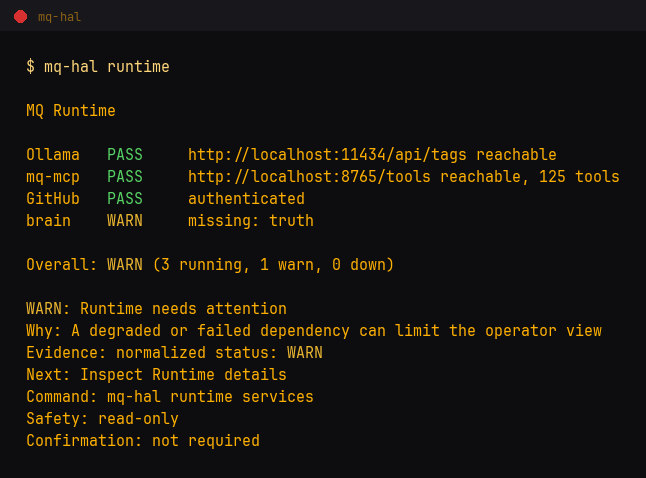
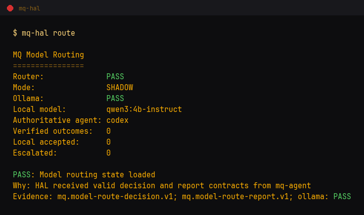
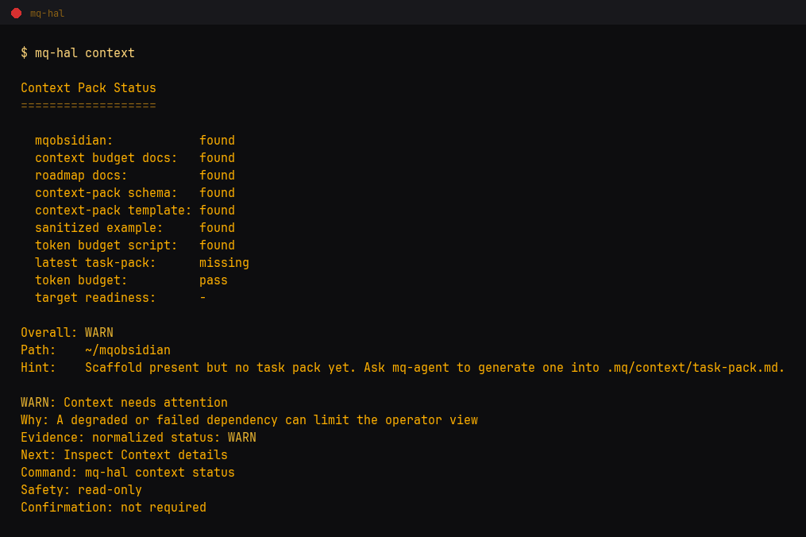

# mq-hal

Local operator layer for the MQ stack.

[](LICENSE)
[](VERSION)

`mq-hal` gives a human-friendly command surface for local repo status, stack
status, release status, runtime health, model-routing evidence, mqobsidian context readiness, and safe
natural-language routing through Ollama.

Live site: <https://mcamner.github.io/mq-hal/>

## Operator Role

```text
mqlaunch -> mq-hal -> mq-agent / mq-mcp / repo-signal / mqobsidian
```

`mq-hal` shows and routes. It does not own stack gates, release decisions,
review logic, semantic memory, or durable truth.

Source-of-truth split:

* `mq-agent` owns orchestration, stack gates, release checks, and context export.
* `mq-mcp` owns bounded tool runtime, review contracts, and learning tools.
* `repo-signal` owns repo health, readiness, README, and docs scoring.
* `mqobsidian` owns durable memory, truth exports, and context compression.
* `mqlaunch` owns terminal menus and workflow entrypoints.

## Quick Start

```bash
git clone https://github.com/MCamner/mq-hal.git ~/mq-hal
cd ~/mq-hal
./install.sh

mq-hal version
mq-hal config-check
mq-hal brief
mq-hal stack
mq-hal dashboard
mq-hal route
```

Local router setup: `brew install ollama && brew services start ollama`, then
`ollama pull qwen3:4b-instruct`.

The router uses local `qwen3:4b-instruct`; planner/critic/code profiles use
OpenAI `gpt-5.4-mini`. Cloud commands require `OPENAI_API_KEY`; HAL never
includes the key in output or session memory.

## 30 Second Demo

```bash
mq-hal brief                       # repo operator brief
mq-hal stack --json                # stack cockpit summary from mq-agent
mq-hal context                     # mqobsidian context-pack readiness
mq-hal runtime                     # local service health
mq-hal --explain-intent "kör tester i mq-hal"
mq-hal --confirm "kör doctor"      # confirmation-gated routing
```

Through mqlaunch:

```bash
mqlaunch hal
mqlaunch hal brief
mqlaunch hal release-brief
mqlaunch hal audit
mqlaunch hal repo-status
mqlaunch hal timeline
```

## Examples

`mq-hal route inspect` — read-only routing decision, owned by `mq-agent`:

```text
$ mq-hal route inspect "Review docs"
Decision: route-c0ba572d8331a155
Task class: docs-review
Risk: low
Route: local-shadow
Reasons: read-only, deterministic-verification-available
Escalate: schema-invalid, verification-failed, confidence-below-threshold, policy-requires-cloud
```

## Screenshots

Rendered from live command output by
[tools/generate_screenshots.py](tools/generate_screenshots.py), never edited by hand.







## Main Command Groups

| Area | Commands |
| --- | --- |
| Repo brief | `mq-hal brief`, `mq-hal audit`, `mq-hal repo-status`, `mq-hal ci` |
| Stack | `mq-hal stack`, `mq-hal stack-status`, `mq-hal status` |
| Release | `mq-hal release`, `mq-hal release-brief` |
| Brain/context | `mq-hal brain`, `mq-hal context` |
| Runtime | `mq-hal runtime`, `mq-hal models`, `mq-hal model-status` |
| Model routing | `mq-hal route`, `mq-hal route inspect`, `mq-hal route history`, `mq-hal route accuracy`, `mq-hal route explain` |
| Safe planning | `mq-hal plan`, `mq-hal code-plan`, `mq-hal critic` |
| Dashboard | `mq-hal`, `mq-hal dashboard` |
| Session memory | `mq-hal session`, `mq-hal last`, `mq-hal timeline` |
| Operator action | `mq-hal next`, `mq-hal fix`, `mq-hal open <file>` |
| Router | `mq-hal "prompt"`, `--raw-intent`, `--explain-intent`, `--confirm` |

The canonical command list is [docs/COMMAND_SURFACE.md](docs/COMMAND_SURFACE.md):
it is the single source of truth and `release-check.sh` fails if it drifts from
`bin/mq-hal`. [docs/hal-command-surface.md](docs/hal-command-surface.md) is a
longer human reference and is not drift-checked.

## Safety Boundary

```text
prompt -> local model or deterministic parser -> JSON intent -> Python router
```

Rules:

* the model never runs shell directly
* unknown commands are refused
* unsafe shell operators are rejected
* write or destructive actions require explicit confirmation
* `fix-doctor` prints repair plans but executes nothing
* `execute` dry-runs by default and requires `--confirm`
* session memory is local and can be disabled

See [docs/INTENT_CONTRACT.md](docs/INTENT_CONTRACT.md).

## Operator Views

`mq-hal` is intentionally read-heavy:

* `stack` reads `mq-agent stack cockpit --json` when available.
* `release` reads `mq-agent stack release-check --json`.
* `context` reads the local `mqobsidian` context-pack scaffold.
* `runtime` checks local service health for Ollama, mq-mcp, GitHub, and brain.
* `route` reads decisions and verified aggregate evidence from `mq-agent`.
* `brain` previews mqobsidian and local HAL memory state.
* `dashboard` combines stack, brain, release, runtime, routing, timeline, and alerts.

The interactive dashboard reports refresh, back, invalid-choice, and exit
status directly. Confirmed `open` and `fix` actions report completion or the
underlying non-zero exit status.

The main operator surfaces use the versioned `mq.feedback.v1` model. Status is
always one of `PASS`, `WARN`, `FAIL`, `SKIPPED`, or `UNAVAILABLE`; actionable
results include an advisory `next_action` with command and safety metadata.

These views summarize state; they do not publish, tag, review code, write
semantic memory, or define new gates.

## Natural-Language Routing

Examples:

```bash
mq-hal "visa git status i repo-signal"
mq-hal --raw-intent "kör doctor"
mq-hal --explain-intent "kör tester i mq-hal"
mq-hal --confirm "skapa branch för release"
mq-hal --no-ai "visa git status i mq-agent"
```

Configured repos live in `config/repos.json`. The router resolves names to
known repo paths and only runs allowlisted actions.

## Development

Keep `mq-hal` small and predictable. Before opening a PR, run:

```bash
./release-check.sh
mq-hal config-check
```

When adding a command, update:

* `bin/mq-hal`
* `docs/COMMAND_SURFACE.md`
* `docs/hal-command-surface.md`
* smoke tests
* release notes and version files when releasing

Do not put HAL business logic in `macos-scripts`; expose it through a thin
`mqlaunch` bridge instead.

## Roadmap

Current release is v2.3.0 (Local-First Model Routing Control Room). It makes
the local-vs-cloud routing decision visible from the operator layer without
moving routing ownership into `mq-hal`; automatic local routing remains
disabled after the evidence gate returned `NOT_ELIGIBLE`. Full release map:
[ROADMAP.md](ROADMAP.md).

## Docs

* [Guide](docs/mq-hal-guide.md)
* [Install](docs/INSTALL.md)
* [Command surface](docs/COMMAND_SURFACE.md)
* [Detailed command reference](docs/hal-command-surface.md)
* [Integration contract](docs/INTEGRATION.md)
* [Intent contract](docs/INTENT_CONTRACT.md)
* [Formats](docs/FORMATS.md)
* [Terminal demo](docs/TERMINAL_DEMO.md)
* [Troubleshooting](docs/TROUBLESHOOTING.md)

## License

MIT
